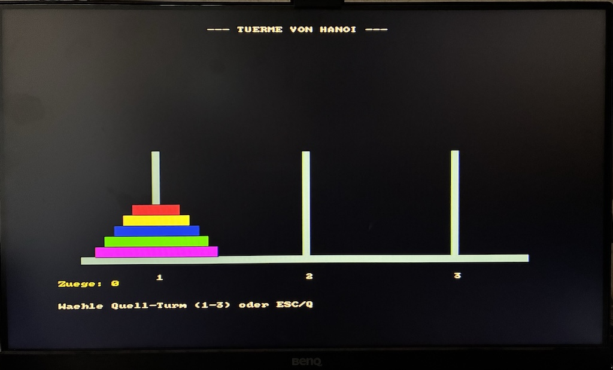

# Teensy-LUA Standalone Computer

auf dem Teensy 4.1 mit VGA, SD-Card-Unterstützung, Fullscreen-Editor mit Syntaxhervorhebung und Hex-Monitor

Grafik-Funktionen

einfache Spiele (Sprites in Planung)

Verwendung von Lua-Modulen über require

# LUA 5.5 auf dem Teensy 4.1 (8MB PSRAM) mit SD-Card und VGA
Implementation der Skripsprache LUA auf dem Microcontroller Teensy 4.1
(ARM Cortex-M7-Prozessor mit 600 MHz) mit Unterstützung des SD-Kartenzugriff's (builtin)
VGA-Ausgabe über Marc Harveight's VGA_t4-Library (Thank you very much for this useful library.)
Fullscreen-Editor (VGA 640x480) mit Syntaxhervorhebung.

--- Diese Version ist eine Alpha-Version. Verwendung auf eigene Gefahr!!! ---

---- Hardware -> MCUME-kompatibel ----
- SD-Card -> Builtin                                                                                                           
- VGA-Beschaltung: R: 3(2k), 4(1k), 33(470) | G:11(2k), 13(1k), 2(470) | B:10(820), 12(390) | HSync:15(82) | VSync:8 (82)     
- PCM5102 : BCK: 21, DIN 7, LCK 20  - Kompatibilität zum MCUME-Projekt - noch nicht implementiert

